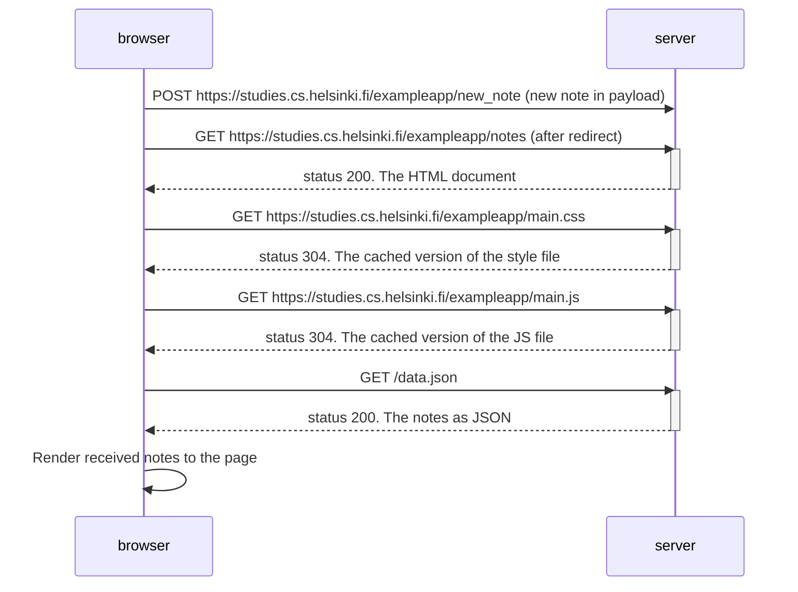

# 0.4 Uusi muistiinpano

```mermaid

sequenceDiagram

participant browser
participant server

browser->>server: POST https://studies.cs.helsinki.fi/exampleapp/new_note (new note in payload)

browser->>server: GET https://studies.cs.helsinki.fi/exampleapp/notes (after redirect)
activate server
server-->>browser: status 200. The HTML document
deactivate server

browser->>server: GET https://studies.cs.helsinki.fi/exampleapp/main.css
activate server
server-->>browser: status 304. The cached version of the style file
deactivate server

browser->>server: GET https://studies.cs.helsinki.fi/exampleapp/main.js
activate server
server-->>browser: status 304. The cached version of the JS file
deactivate server

browser->>server: GET /data.json
activate server
server-->>browser: status 200. The notes as JSON
deactivate server

browser->>browser: Render received notes to the page
```