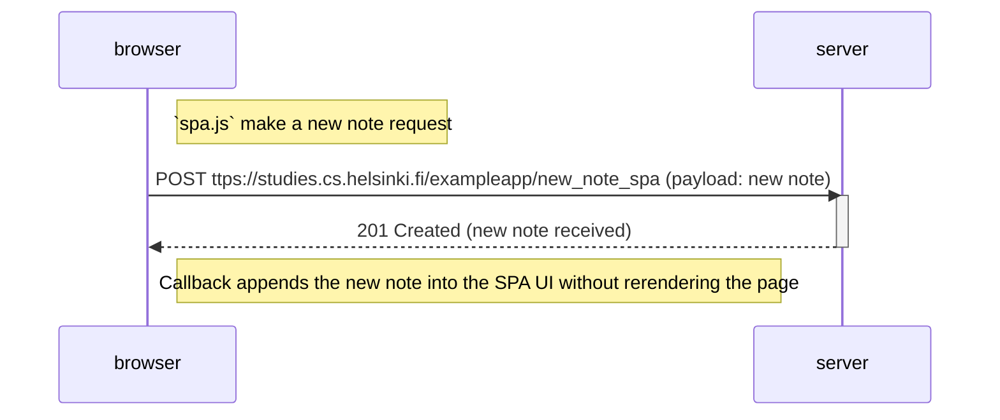

# 0.6 Uusi muistiinpano

```mermaid

sequenceDiagram
    participant browser
    participant server

    Note right of browser: `spa.js` make a new note request

    browser->>server: POST ttps://studies.cs.helsinki.fi/exampleapp/new_note_spa (payload: new note)
    activate server
    server-->>browser: 201 Created (new note received)
    deactivate server

    Note right of browser: Callback appends the new note into the SPA UI without rerendering the page
```